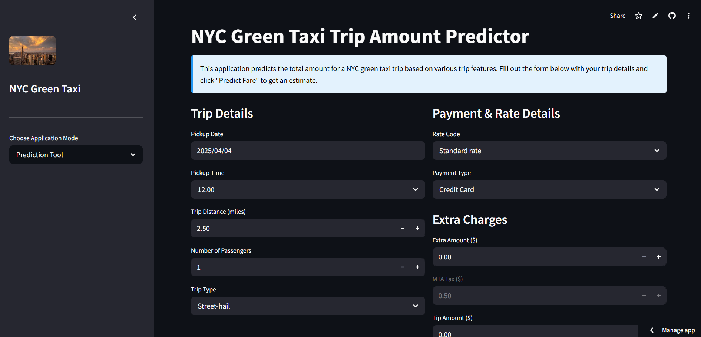

# NYC Green Taxi Trip Data Analysis



This repository contains a comprehensive analysis of NYC Green Taxi trip data from December 2020, focusing on exploratory data analysis, statistical testing, and predictive modeling.

## Project Overview

The project analyzes NYC Green Taxi trip data to understand patterns in trip costs, trip duration, payment methods, and passenger behavior. The analysis includes:

- Data cleaning and preprocessing
- Exploratory data analysis
- Statistical testing of hypotheses
- Predictive modeling for total trip amount
- A Streamlit application for interactive predictions

## Dataset

The analysis uses the `green_tripdata_2020-12.parquet` file, which contains NYC Green Taxi trip records from December 2020. The dataset includes information such as:

- Pick-up and drop-off times
- Trip distance
- Fare amounts
- Payment types
- Passenger counts
- Geographic locations (pick-up and drop-off)

## Features

- **Data Cleaning**: Handling missing values, creating new features, and preparing the data for analysis
- **Exploratory Analysis**: Visualizations of payment types, trip types, and temporal patterns
- **Statistical Testing**: ANOVA tests for comparing means across categories and Chi-square tests for association
- **Predictive Modeling**: Implementation of multiple regression models:
  - Multiple Linear Regression
  - Decision Tree
  - Random Forest
  - Gradient Boosting
- **Interactive Application**: A Streamlit app for predicting trip costs based on user inputs

## Requirements

```
pandas
numpy
matplotlib
seaborn
scikit-learn
scipy
streamlit
pyarrow  # For reading parquet files
```

## Installation

1. Clone this repository:
```bash
git clone https://github.com/yourusername/nyc-taxi-analysis.git
cd nyc-taxi-analysis
```

2. Install the required packages:
```bash
pip install -r requirements.txt
```

3. Download the dataset:
   - The NYC TLC trip data can be downloaded from [NYC TLC Trip Records](https://www1.nyc.gov/site/tlc/about/tlc-trip-record-data.page)
   - Save the file as `green_tripdata_2020-12.parquet` in the project directory

## Usage

### Jupyter Notebook

Run the Jupyter Notebook to execute the complete analysis:
```bash
jupyter notebook NYC_Green_Taxi_Analysis.ipynb
```

### Streamlit App

Run the Streamlit app for interactive predictions:
```bash
streamlit run streamlit_app.py
```

## Project Structure

```
nyc-taxi-analysis/
├── NYC_Green_Taxi_Analysis.ipynb      # Main analysis notebook
├── streamlit_app.py                   # Streamlit application
├── lr_model.pkl                       # Saved Linear Regression model
├── scaler.pkl                         # Saved feature scaler
├── green_tripdata_2020-12.parquet     # Dataset (to be downloaded separately)
├── requirements.txt                   # Package dependencies
└── README.md                          # This file
```

## Results

Key findings from the analysis include:
- Patterns in trip fares based on weekday and time of day
- Differences in tipping behavior across payment methods
- Factors that most significantly influence total trip costs
- Performance comparison of different machine learning models

## Future Work

- Integration of geographic data for spatial analysis
- Time series analysis of trip patterns
- Incorporating weather data for additional insights
- Deployment of the model as a web service

## License

This project is licensed under the MIT License - see the LICENSE file for details.

## Acknowledgements

- NYC Taxi & Limousine Commission for providing the dataset
- The scikit-learn and pandas teams for their excellent libraries
